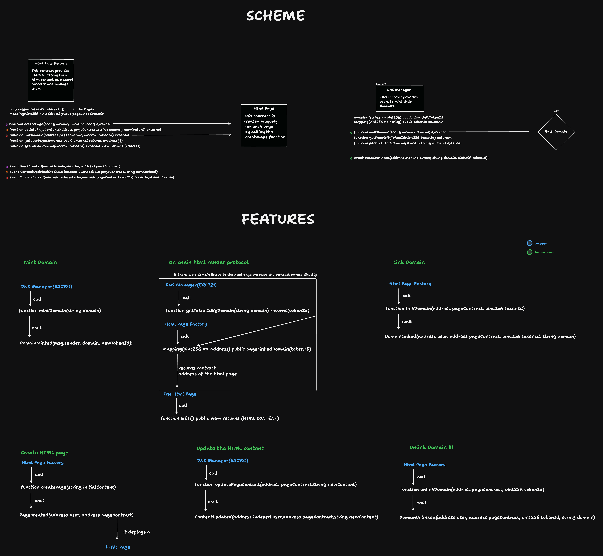

# Liberum

Liberum is a decentralized domain and hosting infrastructure that leverages **blockchain technology** to provide a censorship-resistant, fully user-controlled internet experience. By using **Blockspaces** (ERC-721 tokens representing domain names) and **on-chain storage** for HTML content, Liberum removes the need for centralized DNS providers and traditional cloud hosting services.

---

## Overview

- **Decentralized Domains:** Users mint **Blockspaces**, which serve as unique, blockchain-registered domain names. Each Blockspace is an ERC-721 NFT that can be traded, transferred, or renewed.
- **On-Chain Content:** HTML files and other assets are stored directly in a smart contract. With **GET, POST, PUT, and DELETE** functions, users can update their content without centralized intermediaries.
- **Browser Extension:** A custom extension for Chrome (and potentially other browsers) that resolves `.lib` domains via smart contracts instead of DNS. When someone types a `.lib` address, the extension fetches and renders the site directly from the blockchain.
- **Censorship Resistance:** Because domains and content are on-chain, there is no single point of failure and no centralized entity that can remove or block access.

---

## Key Features

1. **Blockspaces (Domains)**

   - **ERC-721 NFTs:** Each Blockspace is minted as an ERC-721 token, making it easily transferrable and tradeable.
   - **Time-Limited Mint:** Domains can be minted for a defined period (e.g., one or two years). After expiration, the owner must renew, akin to a traditional domain model.
   - **Decentralized Discovery:** Newly minted domains appear in the “Newest” section, and the most popular domains (based on anonymous visit data) show up in “Trending.”

2. **On-Chain Content Management**

   - **Smart Contract Storage:** User HTML content is stored directly on the blockchain, secured by cryptographic consensus.
   - **CRUD Operations:** A specialized smart contract supports **GET, POST, PUT, and DELETE**, giving users total control over their site’s data and layout.
   - **Scalable with Conduit G2:** By leveraging Conduit G2’s high throughput and low fees, Liberum makes storing larger files more cost-effective compared to conventional on-chain solutions.

3. **Browser Extension**

   - **Seamless .lib Resolution:** Automatically detects `.lib` domains in the address bar, fetches content from the blockchain, and renders it in the browser.
   - **Anonymous Visit Tracking:** With user consent, the extension anonymously tracks visits to `.lib` domains, enabling “Top Sites” and “Trending” rankings on Liberum’s main screen.
   - **User-Centric:** Eliminates the need for centralized DNS or hosting services, giving complete ownership and control to the user.

4. **DAO & Multisig Support**

   - **Collaborative Ownership:** Domains and content can be managed not only by individuals but also by DAOs or multisig wallets for collective decision-making.
   - **Secure Governance:** DAOs can mint, transfer, or renew Blockspaces, and update content, ensuring transparent, democratic control.

5. **Ranking & Discovery**
   - **Trending Domains:** Based on the extension’s aggregated (anonymous) visit data, highly visited `.lib` sites are displayed in a leaderboard.
   - **Newest Domains:** Freshly minted Blockspaces are automatically listed in the main interface, fostering continuous community discovery.

---



---

## Demo & Screenshots

We have prepared a **pitch deck** (included in this repository) illustrating how Liberum works step by step:

1. **Minting a Blockspace:** Users pick a unique `.lib` name, select a registration period, and mint the ERC-721 token representing their domain.
2. **Linking Content:** Upload HTML (or other files) to the Liberum smart contract, creating a fully on-chain website.
3. **Visiting a .lib Site:** With the Liberum extension, simply type your `.lib` address in the browser, and Liberum will fetch and display your on-chain site.
4. **Discovery & Trends:** Check out the “Newest” or “Trending” lists to find interesting decentralized websites from the Liberum community.

---

## Roadmap

| Milestone                     | Description                                                                                                     | Target Date |
| ----------------------------- | --------------------------------------------------------------------------------------------------------------- | ----------- |
| **Build PoC**                 | Create a minimal, functional prototype demonstrating on-chain domain resolution & hosting.                      | Q1 2025     |
| **Infrastructure Analysis**   | Investigate size constraints, wallet integration issues, and security challenges for on-chain UIs.              | Q2 2025     |
| **Hybrid Storage Approach**   | Integrate solutions like IPFS or Arweave for larger files while retaining on-chain hosting for smaller content. | Q3 2025     |
| **Developer Tools & SDK**     | Provide libraries and CLI tools to streamline building on Liberum’s ecosystem.                                  | Q4 2025     |
| **Fully On-Chain Experience** | Gradually migrate Liberum’s own interface on-chain, supporting DeFi, NFTs, etc.                                 | Q3 2026     |

---

## Team

- **Yunus Emre Malkoç** – Software Developer
- **Ali Enes Gök** – Software Developer
- **Berkay Gündüz** – Software Engineer
- **Kutay Sarı** – Software Engineer
- **Kerem Kaya** – Product Designer

---

## Getting Started

1. **Install Liberum Extension:** Download and install the Liberum extension for your supported browser.
2. **Acquire Testnet ETH:** Ensure your wallet (e.g., MetaMask) is funded with testnet ETH (on **Conduit G2** or another designated network).
3. **Mint a Blockspace:** Register your unique `.lib` name with a specified duration.
4. **Upload Content:** Use the Liberum dashboard to upload your HTML content into a smart contract.
5. **Access Your Site:** Type `yourdomain.lib` in the address bar, and Liberum will fetch and display your on-chain site.

---

## Contributing

We welcome contributions from the community! To get involved:

1. **Clone the Repositories:**

```
git clone https://github.com/berkay1532/LiberumContracts.git`
git clone https://github.com/berkay1532/LiberumDashboard.git
git clone https://github.com/KkutaySarii/liberum-frontend.git
git clone https://github.com/KkutaySarii/liberum-plugin.git
```

2. **Install Dependencies:** Run `npm install` or `yarn install`.
3. **Open a Pull Request:** Propose changes or new features via a pull request, and we’ll review it as soon as possible.

---

## License

This project is released under the [MIT License](LICENSE), allowing commercial and private modification and distribution.

---

## Contact

- **Email:** [contact4kerem@gmail.com](mailto:contact4kerem@gmail.com)
- **Official Site:** [www.liberum.space](https://www.liberum.space)

---

**Join us in shaping the future of the decentralized web!**
